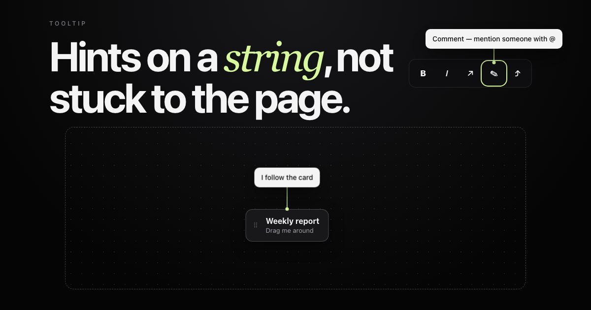

# Tether

A tooltip that **hangs from its target on an elastic string**. It grows out of
the element, trails a beat behind when the target moves, and the string sways
with the pull before everything settles.

**[→ Live demo](https://yagnikbarasiya23.github.io/tether-tooltip/)**



Zero dependencies. About 12 kB of JavaScript, 3.8 kB gzipped, plus 0.5 kB of CSS.

## Why a string

Most tooltips are glued to their target: when the target moves, the tooltip
teleports with it. That's fine for a label, but onboarding hints, pinned
callouts and tips on draggable things feel more alive — and are easier to
follow with your eye — when the connection is visible and has a little give.

## Run it

You need [Node.js](https://nodejs.org) 20.19 or newer.

```bash
git clone https://github.com/YagnikBarasiya23/tether-tooltip.git
cd tether-tooltip
npm install
npm run dev
```

Open the URL it prints — usually <http://localhost:5173>.

```bash
npm test          # unit tests for placement and the string curve
npm run build     # → dist/
npm run preview   # serve what you just built
```

## What's in here

| File | What it does |
| --- | --- |
| `tether.js` | Placement, the bubble springs, the string and the show/hide behaviour |
| `tether.css` | The bubble and string styles |
| `index.html`, `style.css`, `app.js` | The demo page |
| `test/tether.test.js` | Tests for flipping, edge sliding, tie-on points and the curve |

Only `tether.js` and `tether.css` are needed in your project.

## How it works

**Placement.** `place()` tries the side you asked for and flips to the
opposite side if the bubble wouldn't fit; if neither fits it keeps your side.
Then it slides the bubble along the edge so it stays inside the viewport.
The string always starts at the middle of the anchor edge facing the bubble,
so a bubble pushed sideways by the screen edge still points at its target.

**Springs, not positions.** The bubble has springs for x, y and scale. When
the anchor moves — scrolling, resizing, dragging, or its content changing
size — Tether only updates the targets. The bubble catches up on its own, and
while it's catching up it carries velocity.

**The string reads that velocity.** Every frame the string is redrawn as a
quadratic curve from the anchor to the bubble. Sideways velocity pushes the
control point off the straight line, so the string bows the way a real one
lags behind. When the bubble gets closer than the string's rest length the
extra slack bends it too. At rest it's perfectly straight.

**Growing and shrinking.** On show, the bubble starts at the anchor at 40 %
scale and springs out; on hide it springs back into the anchor and fades.
Opacity follows the scale spring, so both directions feel continuous, and a
tooltip re-shown while it's still leaving turns around mid-flight.

The bubble moves with `transform` and `opacity`. The string is an SVG path
whose `d` attribute is rewritten each frame while something is moving.

## Accessibility

- The bubble has `role="tooltip"` and is linked to its anchor with
  `aria-describedby`, added alongside any IDs already there.
- Tooltips open on keyboard focus as well as hover, and <kbd>Esc</kbd>
  closes them.
- With `interactive: true` the pointer can move onto the bubble without it
  closing — use this for tips that contain links or longer text.
- `prefers-reduced-motion: reduce` places and removes the bubble instantly
  with a straight string.

## Browser support

Current Chrome, Edge, Firefox and Safari. Uses `ResizeObserver` to follow
anchors and bubbles that change size.

## Using it in your own project

Copy `tether.js` and `tether.css`, then:

```html
<link rel="stylesheet" href="tether.css">
<button data-tether="Insert link · ⌘K" aria-label="Link">↗</button>
<button id="help" aria-label="Username rules">?</button>

<script type="module">
  import Tether from './tether.js';

  Tether.mountAll(); // every [data-tether]; data-placement sets the side

  new Tether(document.querySelector('#help'), {
    content: document.querySelector('#rules').content.cloneNode(true),
    placement: 'right',
    interactive: true,
  });
</script>
```

For an onboarding step that stays open, pass `open: true` (or call
`pin()`); call `reposition()` whenever you move the anchor yourself.

### Options

| Option | Default | |
| --- | --- | --- |
| `content` | `''` | Text, or a DOM node / fragment |
| `placement` | `'top'` | `top`, `bottom`, `left` or `right` |
| `gap` | `36` | String length at rest, in px |
| `delay` | `120` | Hover delay before showing, in ms |
| `open` | `false` | Start pinned open and ignore hover |
| `interactive` | `false` | Keep open while the pointer is on the bubble |
| `stiffness` | `150` | Spring stiffness; higher follows more tightly |
| `damping` | `14` | Spring damping; lower sways more |

`Tether.mountAll(root, options)` also reads `data-tether-template` (the id of
a `<template>`) when `data-tether` is empty.

### Methods and events

| | |
| --- | --- |
| `show()`, `hide()` | Open or close now |
| `pin(open)` | Keep open (`true`) or return to hover behaviour (`false`) |
| `setContent(content)` | Replace the text or node |
| `reposition()` | Re-measure after you move the anchor |
| `configure(options)` | Change any option at runtime |
| `destroy()` | Remove the bubble, the string and all listeners |
| `tether:show`, `tether:hide` | Fire on the anchor |

Theme with custom properties on `.tether-bubble`: `--tether-bg`,
`--tether-fg`, `--tether-string` and `--tether-radius`.

## Licence

[MIT](LICENSE) © 2026 Yagnik Barasiya. Use it in personal and client work.

More components at [yagnikbarasiya.com/components](https://www.yagnikbarasiya.com/components).
